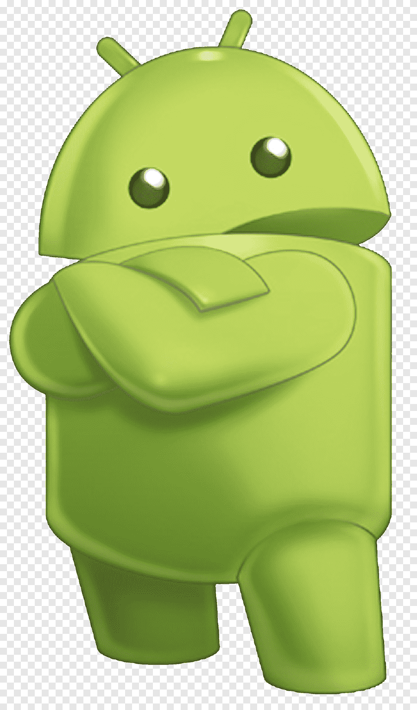
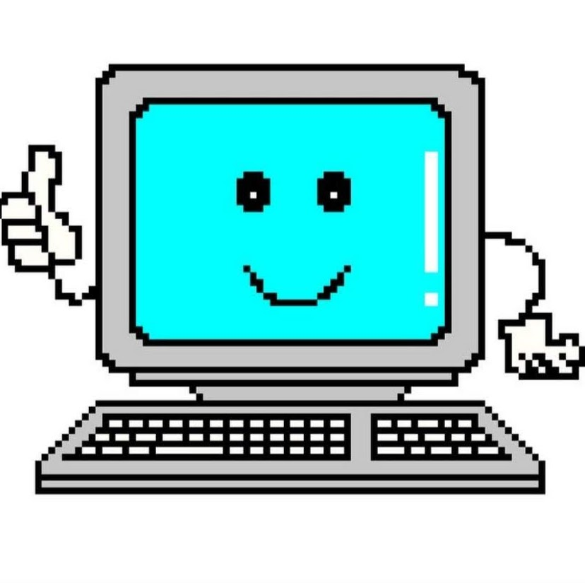
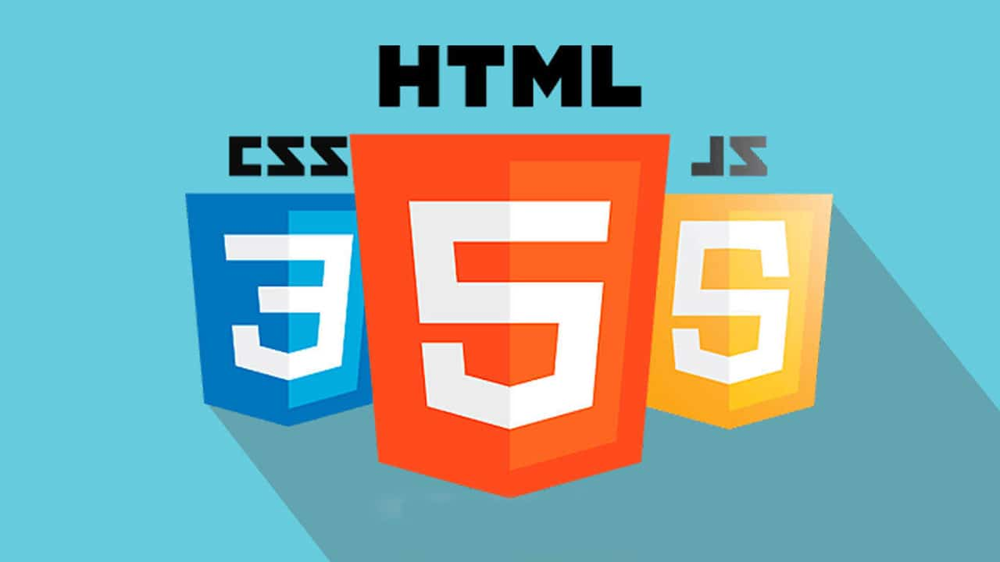
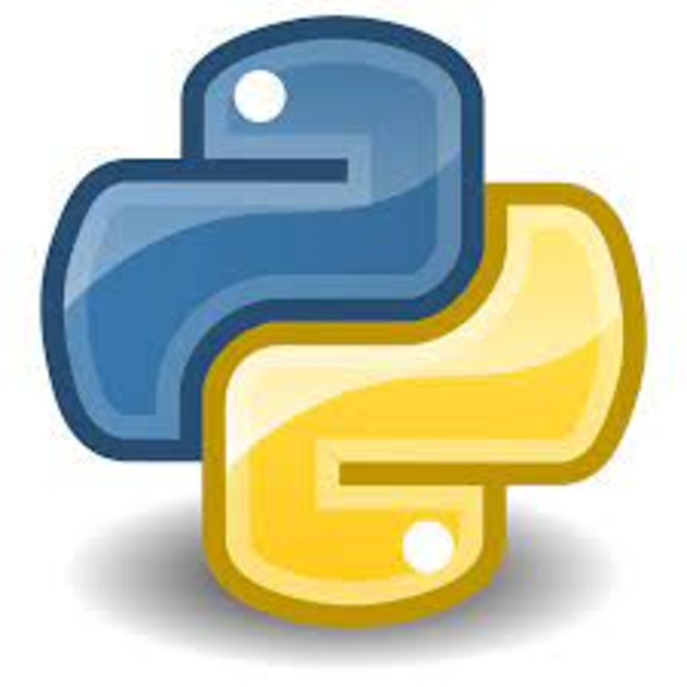
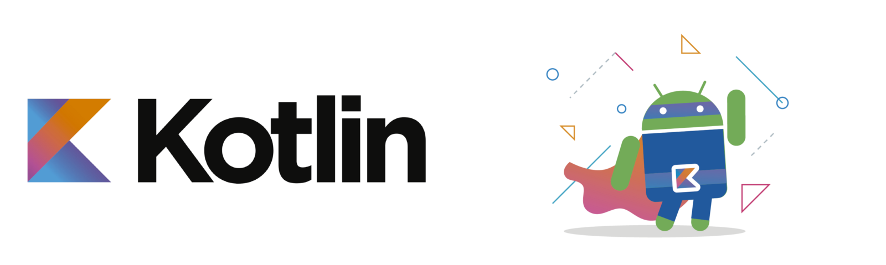

<h1>Hello, my name is Zhenya</h1>

    <h3>About Me:</h3>
    
: And so, I am already 17 years old, and soon I will be 18 at all!

    
: <b>Android and WEB developer</b>

    
: Oddly enough, but I have been interested in programming since I was 16 years old!

    
: I also know how to play musical instruments

    
: I could still write a lot of cool facts, but, damn it, it will be a long time(

    <h2>What languages do I program in at all?</h2>
    

        
        
Java is my first programming language that I started learning, as well as the main language that I use now. "Why did you choose this language first?" - perhaps you have such a question. Like all beginners in programming, I acted on one principle - it's to learn the coolest and most popular language, but now I can't imagine myself without my beautiful, beloved language - Java. Its syntax seems to me so correct that, sometimes, some other languages seem intimidating to me. In the future I plan to stay with Java, but also to learn all new programming languages and their technologies.

         
        
        
After a relatively long study of the Java language, I had a need to try myself in Frontend. After all, this is even cooler than Backend, since you immediately observe the result of your work. It's like writing musical notes on a special piece of paper and playing a musical instrument while enjoying beautiful music. Nevertheless, I still plan to do more Backend, because there is nothing cooler than creating the logic of the application and its behavior in general. <i>And who knows, maybe FullStack will work :)</i>

         
        
        
And sometimes I had to write in the Python programming language. These were mainly integrations with popular APIs of messengers and social networks, such as VKontakte, Telegram, Discord. And also <s>this is the language</s> <b>in fact, I wrote in Python and Java</b>, in which I wrote the computer science exam (EGE) this year.

    

    <h2>What am I planning next?</h2>
    
Firstly, it is to get acquainted with the Kotlin programming language, since, unfortunately, Java has faded into the background in Android development, and Kotlin is becoming more and more popular.

    
    

    <ul>
        <li><b>The second thing I would like to pay attention to is the study of special tools for developers, such as: Kubernetes, Docker, Message Brokers, learn more about Linux.</b></li>
        <li><b>I am also fascinated by what is related to computer security, data protection, finding weaknesses in the code, etc. - to create products with minimal vulnerability.</b></li>
        <li><b>Once upon a time I planned to master artificial intelligence and machine learning, but I never got to that. I hope I will be able to defeat neural networks soon!</b></li>
        <li><b>And I also want to study Computer Science!</b></li>
    </ul>
    

    <h4>That's all, we have come to a logical conclusion. The information above will be updated as needed, well, at least I hope so))</h4>

    
<b>Don't forget to <a href="https://jeugenedev.github.io/">visit</a></b>

